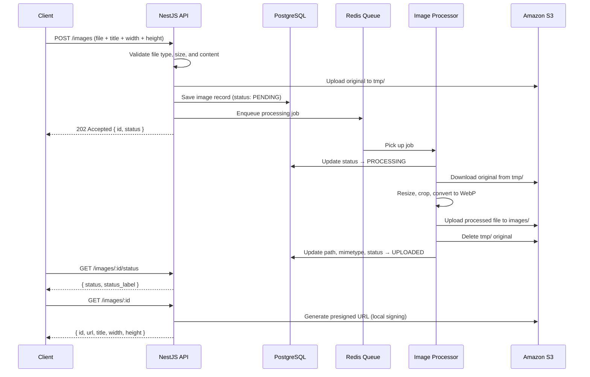

# Image Processor API

REST API for uploading, processing, and serving images. Built with **NestJS**, **PostgreSQL**, **Redis**, **BullMQ**, **Sharp**, and **Amazon S3**.

## Table of contents

- [Features](#features)
- [Tech stack](#tech-stack)
- [Getting started](#getting-started)
  - [Prerequisites](#prerequisites)
  - [1. Configure environment](#1-configure-environment)
  - [2. Start PostgreSQL and Redis (Docker)](#2-start-postgresql-and-redis-docker)
  - [3. Run the application locally (optional)](#3-run-the-application-locally-optional)
  - [Running entirely in Docker](#running-entirely-in-docker)
- [API documentation (Swagger)](#api-documentation-swagger)
- [Image processing flow](#image-processing-flow)
  - [Image statuses](#image-statuses)
- [API endpoints](#api-endpoints)
  - [`POST /images`](#post-images)
  - [`GET /images/:id/status`](#get-imagesidstatus)
  - [`GET /images/:id`](#get-imagesid)
  - [`GET /images`](#get-images)
- [Presigned S3 URLs](#presigned-s3-urls)
- [Environment variables](#environment-variables)
- [Database migrations](#database-migrations)
  - [When migrations run](#when-migrations-run)
  - [Run pending migrations](#run-pending-migrations)
  - [Generate a migration from entity changes](#generate-a-migration-from-entity-changes)
  - [Create an empty migration](#create-an-empty-migration)
  - [Revert the last migration](#revert-the-last-migration)
  - [Workflow after adding a migration](#workflow-after-adding-a-migration)
  - [Reset the database](#reset-the-database)
- [Docker](#docker)
  - [Prerequisites](#prerequisites-1)
  - [Quick start](#quick-start)
  - [Local development with Docker infrastructure](#local-development-with-docker-infrastructure)
  - [Common commands](#common-commands)
  - [How it works](#how-it-works)
- [Tests](#tests)
- [License](#license)

## Features

- Upload images in common formats (JPEG, PNG, WebP, GIF, AVIF)
- Resize, crop, and optimize images to requested dimensions (output stored as WebP)
- Store image metadata in PostgreSQL and files in S3
- Asynchronous background processing via Redis queue
- Paginated image listing with case-insensitive title filter
- Presigned S3 URLs for secure, temporary image access
- OpenAPI (Swagger) documentation at `/api`

## Tech stack

| Layer | Technology |
| ----- | ---------- |
| Runtime | Node.js |
| Framework | NestJS |
| Database | PostgreSQL + TypeORM |
| Queue | Redis + BullMQ |
| Storage | Amazon S3 |
| Image processing | Sharp |
| API docs | Swagger (OpenAPI 3) |

## Getting started

### Prerequisites

- [Node.js](https://nodejs.org/) (see `engines` in `package.json`)
- [Docker](https://docs.docker.com/get-docker/) and Docker Compose
- AWS S3 bucket and credentials (for file storage)

PostgreSQL and Redis are provided via Docker — you do not need to install them locally.

### 1. Configure environment

```bash
cp .env.example .env
```

Edit `.env` and set at least your AWS S3 credentials. For **local development** (running the Nest app on your machine), keep:

```
DATABASE_HOST=localhost
REDIS_HOST=localhost
```

See [Environment variables](#environment-variables) for the full list.

### 2. Start PostgreSQL and Redis (Docker)

Start the infrastructure first. The application needs a running database and Redis before it can start.

**First time (applies database migrations automatically):**

On the first run, start all services including `app`. The Docker entrypoint runs pending TypeORM migrations before the application starts — no manual `migration:run` is required.

```bash
docker compose up -d
```

Verify everything is up:

```bash
curl http://localhost:3000
```

Swagger UI: **http://localhost:3000/api**

**Day-to-day (infrastructure only):**

If you prefer to run the Nest app locally (see step 3), you only need PostgreSQL and Redis from Docker:

```bash
docker compose up -d postgres redis
```

> **Note:** Migrations are applied when the `app` container starts. On a fresh database, run `docker compose up -d` once (with `app`) before switching to local development, or start `app` briefly: `docker compose up -d app && docker compose stop app`.

### 3. Run the application locally (optional)

For development with hot reload, stop the Docker `app` container (if running) and start the app from your terminal. It will connect to the Dockerized PostgreSQL and Redis on `localhost`:

```bash
docker compose stop app   # only if the app container is running

npm install
npm run start:dev
```

The API listens on `http://localhost:3000`. Swagger UI at **http://localhost:3000/api**.

### Running entirely in Docker

To run the full stack in containers (production-like):

```bash
docker compose up -d --build
```

Migrations run automatically on container start. See the [Docker](#docker) section for more commands and details.

## API documentation (Swagger)

Interactive OpenAPI documentation is available while the application is running:

**http://localhost:3000/api**

Swagger describes all endpoints, request/response schemas, validation rules, file upload constraints, and possible error responses (400, 404, 422).

## Image processing flow

Uploading an image triggers **asynchronous processing**. The API responds immediately without waiting for resize/optimization to finish. This keeps response times fast even when processing large files, which can take several seconds under load.



### Image statuses

Because processing runs in the background, the client can poll the status endpoint:

| Status | Value | Label | Meaning |
| ------ | ----- | ----- | ------- |
| Pending | `1` | `PENDING` | Uploaded, waiting in queue |
| Processing | `2` | `PROCESSING` | Worker is resizing/optimizing |
| Uploaded | `3` | `UPLOADED` | Ready — available via GET endpoints |
| Failed | `4` | `FAILED` | Processing failed |

Only images with status **UPLOADED** appear in `GET /images` and `GET /images/:id`.

## API endpoints

### `POST /images`

Upload an image for processing.

- **Content-Type:** `multipart/form-data`
- **Fields:**
  - `image` (file) — required; allowed types: `image/jpeg`, `image/png`, `image/webp`, `image/gif`, `image/avif`; max size: 5 MB (configurable via `FILE_MAX_SIZE`)
  - `title` (string) — required
  - `width` (integer) — target width in pixels
  - `height` (integer) — target height in pixels
- **Response:** `202 Accepted`

```json
{
  "id": 1,
  "status": 1,
  "status_label": "PENDING"
}
```

The image is resized/cropped to the given dimensions, converted to WebP, and optimized in the background.

---

### `GET /images/:id/status`

Check processing status of an uploaded image. Added because processing is asynchronous — the client needs a way to know when the image is ready.

- **Response:** `200 OK`

```json
{
  "status": 3,
  "status_label": "UPLOADED"
}
```

---

### `GET /images/:id`

Get a single processed image.

- **Response:** `200 OK` (only when status is `UPLOADED`)

```json
{
  "id": 1,
  "url": "https://bucket.s3.region.amazonaws.com/images/uuid-name.webp?X-Amz-Signature=...",
  "title": "My photo",
  "width": 800,
  "height": 600
}
```

Returns `404` if the image does not exist or is not yet processed.

---

### `GET /images`

List processed images with pagination and optional title filter.

- **Query parameters:**
  - `offset` (number, default: `0`)
  - `limit` (number, default: `20`, max: `100`)
  - `title` (string, optional) — case-insensitive "contains" search
- **Response:** `200 OK`

```json
{
  "offset": 0,
  "limit": 20,
  "total": 42,
  "data": [
    {
      "id": 1,
      "url": "https://...",
      "title": "My photo",
      "width": 800,
      "height": 600
    }
  ]
}
```

## Presigned S3 URLs

Image files are stored in a **private** S3 bucket. Direct S3 URLs without authentication return `AccessDenied`.

When you call `GET /images` or `GET /images/:id`, the API returns a **presigned URL** — a temporary link that grants read access to a specific object for a limited time.

- Signing happens **locally** on the server (no extra AWS API call per URL)
- Default expiry: **1 hour** (`AWS_S3_SIGNED_URL_EXPIRES`, in seconds)
- After expiry, request a fresh URL by calling the API again
- AWS credentials never leave the server; only the signed URL is sent to the client

## Environment variables

| Variable | Description |
| -------- | ----------- |
| `PORT` | HTTP port (default: `3000`) |
| `DATABASE_HOST` | PostgreSQL host (`localhost` locally, `postgres` in Docker) |
| `DATABASE_PORT` | PostgreSQL port |
| `DATABASE_USER` | Database user |
| `DATABASE_PASSWORD` | Database password |
| `DATABASE_NAME` | Database name |
| `REDIS_HOST` | Redis host (`localhost` locally, `redis` in Docker) |
| `REDIS_PORT` | Redis port |
| `AWS_REGION` | S3 bucket region |
| `AWS_ACCESS_KEY_ID` | AWS access key |
| `AWS_SECRET_ACCESS_KEY` | AWS secret key |
| `AWS_S3_BUCKET` | S3 bucket name |
| `AWS_S3_SIGNED_URL_EXPIRES` | Presigned URL lifetime in seconds (default: `3600`) |
| `FILE_MAX_SIZE` | Max upload size in bytes (default: `5242880` = 5 MB) |
| `IMAGE_MAX_WIDTH` / `IMAGE_MAX_HEIGHT` | Max allowed dimensions |
| `IMAGE_MIN_WIDTH` / `IMAGE_MIN_HEIGHT` | Min allowed dimensions |

See `.env.example` for a full template.

## Database migrations

This project uses **TypeORM migrations** (not `synchronize`). Schema changes are versioned as TypeScript files and applied explicitly.

| Path | Purpose |
| ---- | ------- |
| `src/modules/database/migrations/` | Migration files |
| `src/modules/database/data-source.ts` | TypeORM CLI data source (local + Docker) |
| `docker-entrypoint.sh` | Runs pending migrations before the app starts in Docker |

### When migrations run

| Environment | How migrations are applied |
| ----------- | -------------------------- |
| **Docker (`app` container)** | Automatically on container start (`docker-entrypoint.sh`) |
| **Local development** | Manually via `npm run migration:run` (after first DB setup) |

On a **fresh database**, ensure migrations have run at least once before using the API:

```bash
# Option A — Docker applies migrations when app starts
docker compose up -d

# Option B — local app with Dockerized Postgres/Redis
docker compose up -d postgres redis
npm run migration:run
npm run start:dev
```

### Run pending migrations

PostgreSQL must be running and `.env` must point at it (`DATABASE_HOST=localhost` for local dev).

```bash
npm run migration:run
```

This builds the project and runs all pending migrations against the database configured in `.env`.

To run migrations in production/Docker (without rebuilding first):

```bash
npm run migration:run:prod
```

### Generate a migration from entity changes

After you change an entity (e.g. `src/modules/image/entities/image.entity.ts`), generate a migration that reflects the diff:

1. Ensure PostgreSQL is running and the database is reachable.
2. Run:

```bash
npm run migration:generate src/modules/database/migrations/DescribeYourChange
```

Example:

```bash
npm run migration:generate src/modules/database/migrations/AddTitleIndexToImage
```

This will:

1. Build the project (`npm run build`)
2. Compare compiled entities with the current database schema
3. Create a new file under `src/modules/database/migrations/`

**Always review the generated migration** before committing — TypeORM may not detect every change perfectly.

### Create an empty migration

For manual SQL or data changes that are not inferred from entities:

```bash
npm run migration:create src/modules/database/migrations/DescribeYourChange
```

Edit the new file in `src/modules/database/migrations/`, then apply it with `npm run migration:run`.

### Revert the last migration

```bash
npm run migration:revert
```

### Workflow after adding a migration

**Local development:**

```bash
npm run migration:run
npm run start:dev
```

**Docker:**

```bash
docker compose up -d --build
```

The new migration file is copied into the image at build time and applied when the `app` container starts.

### Reset the database

To wipe all data and re-apply migrations from scratch:

```bash
docker compose down -v
docker compose up -d
```

`down -v` removes the `postgres_data` volume. The next `up` creates an empty database and runs all migrations again.

## Docker

Run PostgreSQL, Redis, and optionally the application using Docker Compose.

### Prerequisites

- [Docker](https://docs.docker.com/get-docker/)
- [Docker Compose](https://docs.docker.com/compose/) (included with Docker Desktop)

### Quick start

1. Copy and configure `.env` (see [Getting started](#getting-started)).
2. Start all services:

```bash
docker compose up -d
```

3. Verify:

```bash
curl http://localhost:3000
```

The API is at `http://localhost:3000`. Swagger UI at `http://localhost:3000/api`.

Migrations run **automatically** when the `app` container starts. See [Database migrations](#database-migrations) for generating and running migrations manually.

### Local development with Docker infrastructure

A common workflow is to keep PostgreSQL and Redis in Docker, but run the Nest app on your host machine for faster iteration:

```bash
# Start database and queue
docker compose up -d postgres redis

# On first setup only — apply migrations via the app container
docker compose up -d app && docker compose stop app

# Run the app locally
npm install
npm run start:dev
```

Ensure `.env` uses `DATABASE_HOST=localhost` and `REDIS_HOST=localhost` so the local process connects to the exposed Docker ports.

### Common commands

```bash
# Start services (build image if missing)
docker compose up -d

# Start and rebuild the app image after code changes
docker compose up -d --build

# View logs
docker compose logs -f

# View logs for a single service
docker compose logs -f app
docker compose logs -f postgres
docker compose logs -f redis

# Stop services (containers removed, data volume kept)
docker compose down

# Stop services and delete database volume (data loss)
docker compose down -v

# Check service status
docker compose ps
```

### How it works

Docker Compose starts three services defined in `docker-compose.yaml`:

| Service | Image / build | Purpose |
| ------- | ------------- | ------- |
| `postgres` | `postgres:16-alpine` | PostgreSQL database with persistent storage |
| `redis` | `redis:7-alpine` | Job queue for background image processing |
| `app` | Built from `Dockerfile` | NestJS application (production build) |

**Startup order**

1. `postgres` starts and runs a health check (`pg_isready`).
2. `redis` starts.
3. Once Postgres is healthy, `app` starts.
4. The entrypoint runs pending TypeORM migrations, then starts the Nest application.
5. The queue worker runs inside the same `app` process (no separate worker container needed).

**Environment variables in Docker**

- Variables are loaded from `.env` at **container runtime**, not baked into the image.
- `.env` is in `.gitignore` and excluded from the image via `.dockerignore`.
- Inside Docker, `DATABASE_HOST` is set to `postgres` and `REDIS_HOST` to `redis` (Compose service names). For local development without Docker, use `localhost` for both.

**Data persistence**

Database files are stored in the `postgres_data` Docker volume. `docker compose down` stops containers but keeps data. To reset the database: `docker compose down -v`.

**When you change application code**

```bash
docker compose up -d --build
```

**When you add a new migration**

Rebuild and restart the `app` container so the migration is included and applied automatically:

```bash
docker compose up -d --build
```

See [Database migrations](#database-migrations) for generating migrations and local workflows.

## Tests

```bash
# unit tests
npm run test

# e2e tests
npm run test:e2e

# test coverage
npm run test:cov
```

## License

UNLICENSED
